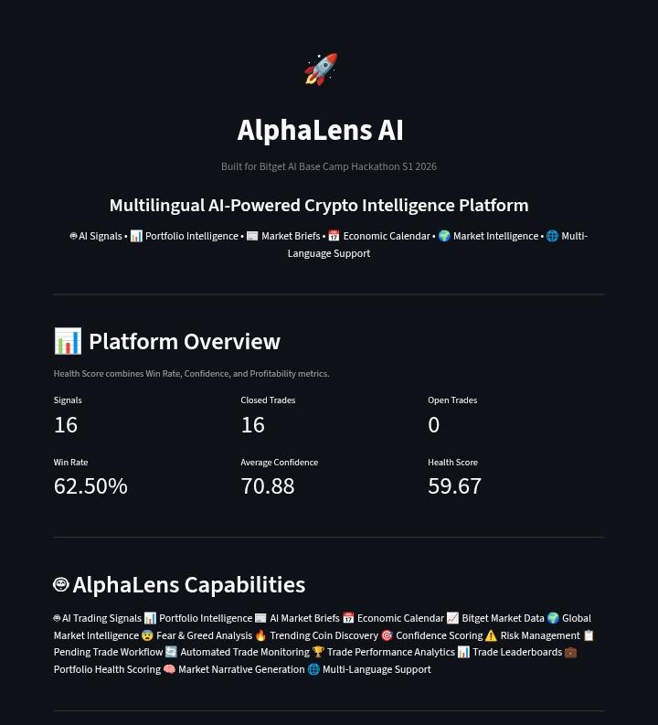
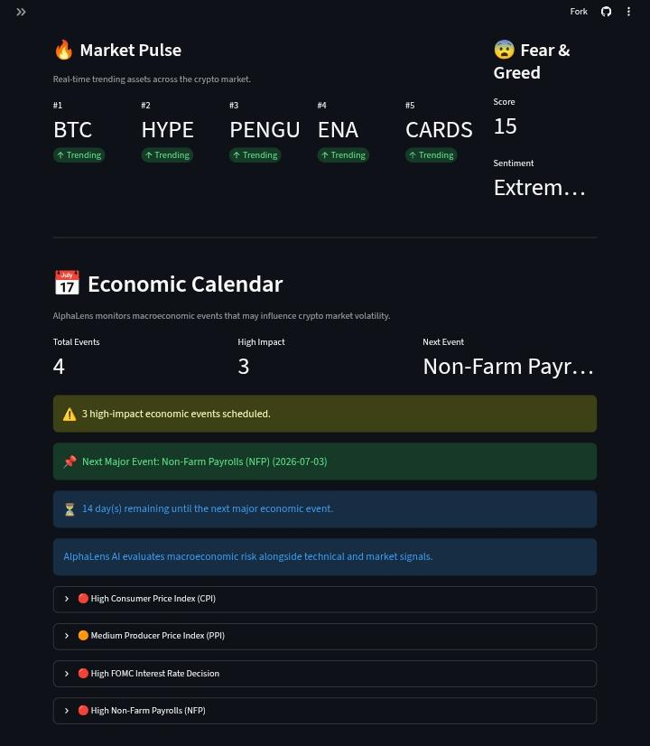
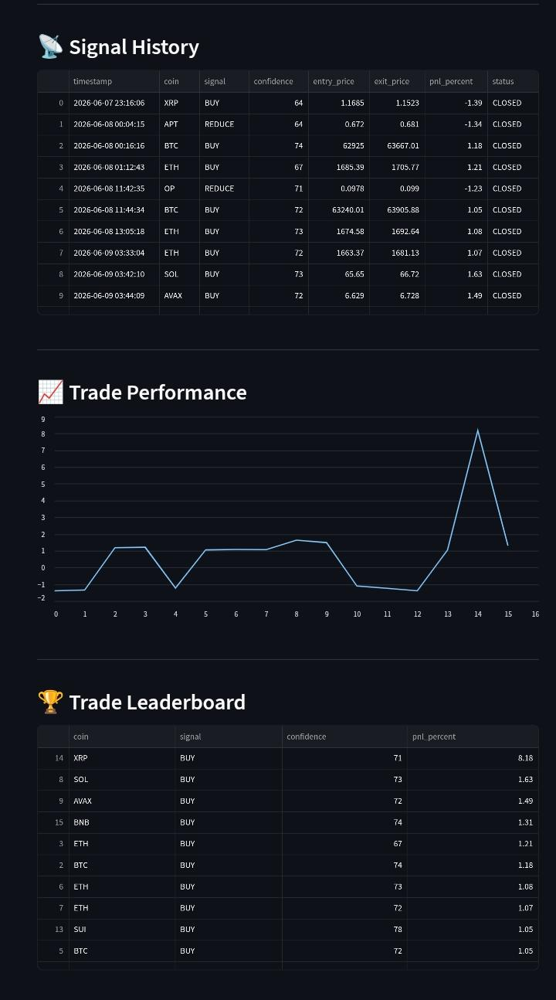

# 🚀 AlphaLens AI

## Multilingual AI-Powered Crypto Intelligence Platform

AlphaLens AI is an AI-powered crypto intelligence platform built for the **Bitget AI Base Camp Hackathon S1 2026**.

The platform combines market intelligence, portfolio analytics, economic event monitoring, paper trading infrastructure, AI-generated market narratives, and multilingual accessibility into a unified decision-support system for crypto traders and investors.

Rather than forcing users to switch between multiple dashboards, news sources, sentiment trackers, portfolio tools, and economic calendars, AlphaLens transforms raw market data into actionable intelligence through Qwen AI.

---

# 🌐 Live Demo

https://alphalensai.streamlit.app

---

# 📸 Dashboard Preview

## 📊 Platform Overview



---

## 🔥 Market Pulse + 📅 Economic Calendar



---

## 📰 Market Brief + 💼 Portfolio Intelligence


---

## 📈 Trade Analytics



---

# ⚙️ Installation

Clone the repository:

```bash
git clone https://github.com/chyokore/alphalensai.git
cd alphalensai
```

Install dependencies:

```bash
pip install -r requirements.txt
```

Create a `.env` file:

```env
QWEN_API_KEY=YOUR_API_KEY
```

Run AlphaLens AI:

```bash
streamlit run dashboard.py
```

---


# 🎯 The Problem

Crypto traders often rely on fragmented workflows involving:

* Market analysis tools
* Portfolio trackers
* Trading signal providers
* Risk management platforms
* News aggregators
* Sentiment monitoring services
* Economic calendar websites

This creates information overload, slows decision-making, and increases the risk of poor trading outcomes.

Most platforms display data.

Very few help users understand what that data means.

---

# 💡 Our Solution

AlphaLens AI acts as an intelligence layer between market data and decision-making.

Using Qwen AI, the platform converts real-time market information into:

* AI-generated trading signals
* Confidence scores
* Portfolio diagnostics
* Risk assessments
* Market narratives
* Daily market briefings
* Economic event awareness
* Paper trading analytics

The result is a unified system that helps users move from observation to action.

---

# 🔥 What Makes AlphaLens Different

AlphaLens combines:

* AI Signal Generation
* Portfolio Intelligence
* Daily Market Briefing
* Economic Event Monitoring
* Market Pulse (Trending Assets)
* Fear & Greed Analysis
* Paper Trading Analytics
* Automated Trade Monitoring
* Pending Trade Workflow
* AI Command Center
* Multi-Language Accessibility

within a single platform.

Rather than offering isolated tools, AlphaLens provides a complete AI-powered crypto intelligence workflow that helps users understand markets, evaluate risk, and make informed decisions.

---

# 🖥️ Dashboard Features

### Platform Overview

Displays:

* Total Signals
* Closed Trades
* Open Trades
* Win Rate
* Average Confidence
* Portfolio Health Score

### Market Pulse

Monitor assets attracting market attention:

* Trending Coins
* Real-Time Asset Monitoring
* Market Discovery Layer

### Fear & Greed Monitor

Track overall market sentiment:

* Fear & Greed Score
* Sentiment Classification
* Risk Environment Awareness

### Economic Calendar

Monitor upcoming high-impact macroeconomic events:

* CPI
* PPI
* FOMC
* NFP
* Impact Levels
* Event Schedules

### Portfolio Intelligence

View AI-generated portfolio diagnostics.

### Daily Market Brief

Access institutional-style market commentary generated by Qwen AI.

### AI Command Center

Launch AlphaLens intelligence workflows:

* Generate Portfolio Intelligence
* Generate Market Brief
* Update Trade Tracker
* Generate AI Signals

### Active Signals

Track currently open AI-generated signals.

### Pending Trade Workflow

Review AI-generated signals before placing paper trades.

### Signal History

Review historical signal activity.

### Trade Performance

Analyze paper trading outcomes.

### Trade Leaderboard

Rank trades by profitability.

### Market Intelligence

* Trending Coins
* Global Market Overview
* Fear & Greed Index
* Economic Calendar

---

# 📈 Current Capabilities

AlphaLens currently demonstrates:

* AI Signal Generation
* Portfolio Intelligence
* Daily Market Brief Generation
* Economic Calendar Integration
* Automated Trade Monitoring
* Pending Trade Workflow
* AI Command Center
* Market Pulse Monitoring
* Fear & Greed Analysis
* Multi-Language Dashboard
* Paper Trading Analytics
* Performance Tracking
* Mobile-Friendly Deployment

---

# 🛠️ Technology Stack

### AI Layer

* Qwen AI

### Backend

* Python

### Dashboard

* Streamlit

### Market Data

* Bitget Market Data
* CoinGecko API
* Alternative.me Fear & Greed Index

### Analytics

* Pandas

### Deployment

* GitHub
* Streamlit Community Cloud

---

# 📁 Project Structure

```text
AlphaLensAI/

├── app.py
├── dashboard.py
├── signal_engine.py
├── economic_calendar.py

├── portfolio.py
├── market_brief.py
├── trade_tracker.py

├── market_data.py
├── bitget_data.py
├── translator.py
├── translations.py

├── screenshots/
│   ├── Platform Overview.png
│   ├── Market Pulse + Economic Calendar.png
│   ├── Market Brief + Portfolio Intelligence.png
│   └── Trade Analytics.png

├── reports/
│   ├── portfolio_report.txt
│   ├── market_brief_*.txt
│   ├── leaderboard.txt
│   ├── portfolio_metrics.txt
│   ├── trade_review.txt
│   └── paper_trading_report.txt

├── signals.csv
├── requirements.txt
└── README.md
```

---

# 🚀 Future Roadmap

* Live Trading Integration
* Advanced Portfolio Optimization
* Strategy Automation
* Agent-Based Research Workflows
* Multi-Asset Expansion
* Institutional Analytics Suite
* Smart Money Monitoring
* AI Portfolio Rebalancing
* Whale Activity Intelligence

---

# 🏆 Built For

**Bitget AI Base Camp Hackathon S1 2026**

Builder: **Chinyere Okore/ Chiondefi**

AlphaLens AI demonstrates how AI can transform fragmented crypto workflows into a unified intelligence platform for traders and investors.

By combining Bitget Market Data, Qwen AI, Portfolio Intelligence, Economic Event Awareness, Paper Trading Infrastructure, Market Pulse Monitoring, and Multi-Language Accessibility, AlphaLens delivers institutional-style crypto intelligence through a single streamlined dashboard.
